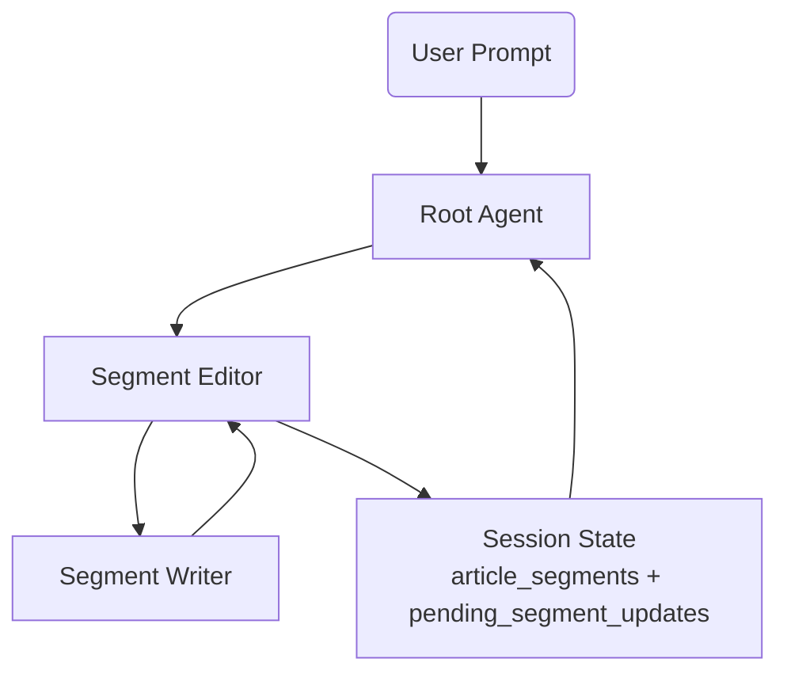
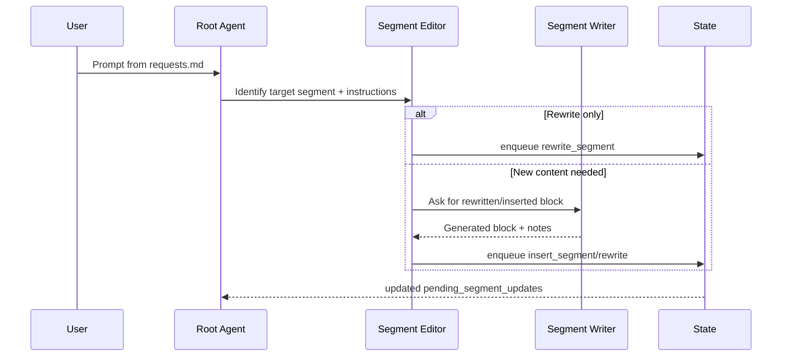

# AI Journalist Flow

This document explains how the current orchestration pipeline works and illustrates it with the scripted scenarios from `requests.md`. Use it as a reference when debugging session state or extending the workflow.

## 1. Architecture Overview

1. **Root Agent** (`ai_journalist/agent.py`) reads `article_segments` from session state and interprets user instructions.
2. **Segment Editor** receives block-level operations, requests fresh prose from the Writer when needed, and pushes every action into `pending_segment_updates`.
3. **Segment Writer** produces a single block (rewrite or brand-new) using the provided neighbors and constraints.
4. **Session State** never mutates `article_segments` directly during the run; instead, it accumulates changes under `pending_segment_updates` plus the `has_pending_segment_updates` flag.

## 2. Message Flow for One Prompt

## 3. Example Walkthrough (`requests.md`)

The testing playbook lists six prompts that run sequentially and cover all common operations:

| # | Scenario | Expected Actions in `pending_segment_updates` |
|---|----------|----------------------------------------------|
| 1 | **Compact Title & Lead** – shorten H1 (`block_506ec105`) and first paragraph (`block_0e987eda`) | Two `rewrite_segment` entries; title may also show `mark_deletion_status` + `insert_segment` if its type changes. |
| 2 | **Context Before First Question** – explain the hackathon before `block_3440e41b` | One `insert_segment` located via `insert_after_segment_id = block_3440e41b`. |
| 3 | **Inspirational Closing** – rewrite `block_42470c5a` | `rewrite_segment` with the new inspirational tone. |
| 4 | **Tightened Q&A + Bridge** – shorten questions, answers, and add a bridge | `rewrite_segment` for `block_114ebcaa` & `block_b73b79d1`; `rewrite_segment` for answers `block_d94e85f6` & `block_c404add1`; `insert_segment` for the bridge (`segment_070fc9a4`). |
| 5 | **Factoid + CTA Rewrite** – insert a fact after `block_b0e717c8` and update the closing | `insert_segment` (`new_block_1`) + another `rewrite_segment` on `block_42470c5a`. |
| 6 | **New Intro Tone** – replace the intro with a two-line lead, add “Why it matters” section | Multiple `rewrite_segment`/`insert_segment` actions touching the former H1, new lead paragraphs, heading `new_heading_block_0e987eda`, and explanatory block `segment_e11965b3`. |

Each scenario stacks on top of the previous ones, so the same `segment_id` can appear multiple times as the article evolves.

## 4. Inspecting `pending_segment_updates`

When reviewing the queue:

1. Confirm that every scripted step has a matching entry (the table above helps map IDs to expectations).
2. Ensure `insert_segment` actions include `insert_after_segment_id` or `insert_before_segment_id`; otherwise placement will be ambiguous.
3. Check that `has_pending_segment_updates` is `true` before attempting to apply changes.
4. Use `notes` fields to learn why a rewrite happened (e.g., “shortened for 40-token limit”).

## 5. Future Enhancements

- Add a helper command that renders diffs directly from `pending_segment_updates`.
- Automate the application/reset of queued changes so `article_segments` and the persisted article stay in sync.
- Extend the documentation with concrete JSON snippets for each scenario once their outputs stabilize.
